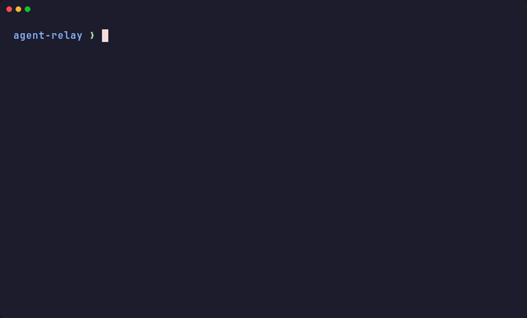

# agent-relay

[](LICENSE)
[](https://github.com/akashpandey/agent-relay/actions/workflows/ci.yml)

> **Pass the baton between Claude Code, Codex, Antigravity, and OpenCode with a single Unix command.**

Small, harness-agnostic shell wrappers and local-first orchestration for running coding agents in non-interactive mode.




## Why these wrappers exist

The main purpose of these wrappers is to make agent delegation easy from any harness that can run a shell command.

That includes:

- Claude Code
- Codex CLI
- OpenCode
- shell scripts
- local automation tools
- other agent runners

The underlying CLIs already work, but their raw command lines are noisy, backend-specific, and awkward to embed repeatedly in prompts or automation. These wrappers give you one stable entrypoint per agent with the same basic shape:

- take a task as an argument or from stdin
- treat the current directory as the workspace root
- inject a small non-interactive system prompt
- pass through a few useful runtime knobs via environment variables
- add enough observability to tell whether the run is alive or stuck
- tee every run's combined output to a timestamped log file under
  `~/agent-relay/logs/` (path override: `AGENT_RELAY_LOG_DIR`), printed in the
  startup banner, so a backgrounded run can be tailed live instead of waiting
  for the final result

That makes them useful as lightweight building blocks inside terminal workflows, shell scripts, and agent harnesses where one model needs to hand off a task to another model through a plain command invocation.

Included wrappers:

- `opencode-agent`
- `opencode-agent-fallback`
- `antigravity-agent`
- `claude-agent`
- `codex-agent`

## What they are good for

These wrappers are useful when you want a harness to delegate a bounded task to a agent without opening an interactive UI.

Common cases:

- a Codex or Claude Code session delegating work to another model
- quick implementation tasks from the terminal
- code review or second-opinion passes on a repo
- one-shot debugging prompts
- delegated work from another agent
- scripted handoffs from tools like `xargs`, shell loops, or CI-adjacent automation
- comparing two model backends on the same task prompt

They are best for short, self-contained tasks where stdout is enough as the return channel.

They are not a queueing system or autonomous workflow engine. `relay` provides
run lookup, structured result parsing, continuation, and cross-harness takeover,
but retries and multi-step planning still belong to the caller.

## Harness-friendly design

These wrappers are intentionally command-shaped so another coding agent can call them without knowing the underlying provider CLI.

The harness only needs to know:

- command name
- working directory
- task text
- optional environment variables

Everything else stays inside the wrapper:

- workspace wiring
- prompt framing
- provider-specific flags
- timeout handling
- basic observability

That gives you a stable delegation surface even if the underlying CLI syntax changes later.

## Requirements

These wrappers assume the backing CLIs are already installed on the host:

- Node.js 24 or newer, for the built-in `node:sqlite` dashboard/index APIs
- `opencode-agent` calls `$HOME/.opencode/bin/opencode`
- `antigravity-agent` calls `$HOME/.local/bin/agy`
- `claude-agent` calls `$HOME/.local/bin/claude`
- `codex-agent` calls `codex`

They are meant for a machine where those tools already exist. The wrappers do not install or manage them.

## Harness skill

Install the shared delegation skill for Codex and Claude Code with:

```bash
./install-skill
```

This creates symlinks from `~/.codex/skills/agent-relay` and
`~/.claude/skills/agent-relay` to the tracked source at
`skills/agent-relay/`. Update that source here; do not edit the installed
links. OpenCode already permits Claude-style skills on this host. Antigravity's
plugin system can import Claude skills when needed, but has no global skill
directory configured yet.

## Usage

```bash
./opencode-agent "Fix the bug"
printf '%s\n' "Review this repo" | ./opencode-agent
./opencode-agent --models

./antigravity-agent "Implement TASK.md"
printf '%s\n' "Review this repo" | ./antigravity-agent
./antigravity-agent --models

./claude-agent "Review this repo"
printf '%s\n' "Review this repo" | ./claude-agent
./claude-agent --models

./codex-agent "Review this repo"
printf '%s\n' "Review this repo" | ./codex-agent
./codex-agent --models
./agent-doctor
```

`./relay` (or `./agent`) is the preferred front door when you want workspace aliases or quick continuation:

```bash
./relay workspaces
./relay doctor
./relay dashboard
./relay dashboard restart
./relay fitschool opencode "Review this repo"
./relay codex "Review the current directory"
./relay attention fitschool
./relay prune --dry-run --older-than 30d
./relay result fitschool
./relay open fitschool
./relay last fitschool
./relay continue fitschool "Fix the issue from the previous run"
./relay continue fitschool --to opencode "Finish tests using another harness"
./relay takeover fitschool codex "Pick up where Claude/OpenCode left off"
```

Provider wrappers still work directly and use the current working directory as the workspace root. When a launch directory maps to a canonical project workspace, the startup banner also prints `canonical_workspace=...`; the run still executes in the original directory.

Canonical workspace grouping is shared by the wrappers and dashboard. Optional config lives at `~/.config/agent-relay/workspaces.json` as either an array of absolute repo paths or an object of names to absolute repo paths. Override the path with `AGENT_RELAY_WORKSPACES_CONFIG` or the default code root with `AGENT_RELAY_CODE_ROOT`.

Run `./agent-doctor` to check Docker, the dashboard container, the compose symlink, and the post-commit restart hook.

## MCP Server

`agent-relay-mcp` exposes a local stdio MCP server for agents that prefer
structured tools over shell commands. It wraps the existing SQLite/dashboard
surfaces; it does not replace the wrappers, logs, or dashboard.

Example MCP command:

```bash
agent-relay-mcp
```

Available tools include `list_workspaces`, `list_runs`, `get_run_result`,
`wait_for_run`, `get_log_tail`, `search_log`, `continue_run`, `takeover_run`,
and `doctor`. Use `get_run_result` or `wait_for_run` for acceptance checks;
raw log tools are diagnostic only.

## Cross-Harness Relay Takeover (Token Exhaustion Handoff)

When you hit a rate limit, quota exhaustion, or context ceiling midway in an interactive harness session (Claude Code, Codex CLI, Antigravity CLI, or OpenCode) or in a agent run, you don't need to re-explain the task from scratch.

`agent-relay` inspects the local session logs across all four harnesses, extracts the working context, inspects current repository changes (`git status` & `git diff`), and packages a structured baton-pass prompt for the target agent harness:

```bash
# Take over in current workspace using Codex:
relay takeover codex

# Take over a named workspace using OpenCode:
relay takeover fitschool opencode

# Take over with an explicit directive:
relay takeover fitschool claude "Finish the remaining unit tests and commit"

# Continue a previous agent run but switch provider:
relay continue fitschool --to codex "Continue where the last run stopped"
```

### What gets passed during takeover:
1. **Original User Goal**: Extracted from the previous harness session.
2. **Files Touched / Inspected**: Working file list referenced by the prior harness.
3. **Previous Harness Status**: The last assistant message, including detected exhaustion causes (e.g. rate limits or token limits).
4. **Git Workspace State**: Uncommitted changes via `git status -s` and `git diff --stat`.
5. **Target Directive**: Clear instructions for the new harness to seamlessly resume and complete the objective.

In the **Web Dashboard**, opening any run modal provides a **🔀 Relay Takeover** card with 1-click commands to transition that run to any alternate harness.

## Session reuse

Fresh runs persist their provider session. For a sequential follow-up, pass the
prior provider session/conversation ID through `AGENT_RELAY_SESSION`:

```bash
AGENT_RELAY_SESSION='<provider-session-id>' \
  ./codex-agent "Implement the fix you proposed."
```

The wrappers map this to each CLI's native resume option. Do not reuse one
session across parallel workers or unrelated tasks; context and file intent
will mix. Copy the provider ID from its run output or session list; every
wrapper also keeps the full run log under `AGENT_RELAY_LOG_DIR`.

The compact result from `agent-wait` and `/api/runs/<log>/result` includes a
`continuation` object when a session ID is available. Use
`continuation.sameSessionCommand` when the same agent should fix its own
issue or continue a closely related task. Use a fresh session for unrelated work
or parallel workers.

## Model catalogues & Dynamic Family Aliases

All wrappers support **dynamic model family aliases** so you never have to hardcode stale version strings in automation or orchestrations (like Council of Experts):

| Wrapper | Family Alias | Dynamically Resolves To |
|---|---|---|
| `antigravity-agent` | `gemini-flash` / `flash` / `latest` | Newest Gemini Flash (High) (e.g. `Gemini 3.8 Flash (High)`) |
| `antigravity-agent` | `gemini-pro` / `pro` | Newest Gemini Pro (High) (e.g. `Gemini 3.1 Pro (High)`) |
| `opencode-agent` | `openai/latest` / `openai/sol` / `gpt-sol` | Newest OpenAI GPT Sol (e.g. `openai/gpt-5.6-sol`) |
| `opencode-agent` | `glm/latest` / `zai/latest` / `glm` | Newest Z.AI GLM (e.g. `zai-coding-plan/glm-5.3`) |
| `opencode-agent` | `glm/flash` / `zai/flash` | Newest Z.AI GLM Flash (e.g. `zai-coding-plan/glm-5.3-flash`) |
| `opencode-agent` | `opencode-go/qwen-latest` | Newest Qwen Max (e.g. `opencode-go/qwen3.8-max`) |
| `opencode-agent` | `opencode-go/deepseek-latest` | Newest DeepSeek Pro (e.g. `opencode-go/deepseek-v4-pro`) |
| `codex-agent` | `latest` / `sol` / `gpt-sol` | Newest GPT Sol (e.g. `gpt-5.6-sol`) |
| `claude-agent` | `opus` / `sonnet` / `latest` | Latest Anthropic model alias |

Refresh or re-list available models before relying on snapshot lists:

```bash
opencode-agent --models --refresh
antigravity-agent --models
```

### OpenCode

`opencode-agent --models` exposes supported providers:

```text
opencode-go/deepseek-v4-flash
opencode-go/deepseek-v4-pro
opencode-go/glm-5.3
opencode-go/gpt-5.6-luna
opencode-go/qwen3.8-max
openai/gpt-5.4-mini
openai/gpt-5.6-sol
openai/gpt-5.6-terra
openai/gpt-5.6-luna
zai-coding-plan/glm-5.2
zai-coding-plan/glm-5.3
zai-coding-plan/glm-5.3-flash
```

### Antigravity

`antigravity-agent --models` lists the models available via Antigravity CLI:

```text
gemini-3.8-flash-high
gemini-3.8-flash-medium
gemini-3.8-flash-low
gemini-3.7-flash-high
gemini-3.7-flash-medium
gemini-3.7-flash-low
gemini-3.6-flash-high
gemini-3.1-pro-high
claude-opus-4-6-thinking
claude-sonnet-4-6
gpt-oss-120b-medium
```

### Claude Code

Claude Code supports native model selectors: `opus`, `sonnet` (and alias `latest`).

### Codex

Codex selectors: `latest` (`gpt-5.6-sol`), `terra` (`gpt-5.6-terra`), `luna` (`gpt-5.6-luna`).

## Typical scenarios

### 1. Delegate a narrow coding task

```bash
cd /path/to/repo
opencode-agent "Update the failing test and explain the change"
```

Useful when you want a direct code-editing agent pass on the current repo without opening an interactive session.

This is the main pattern for use from Claude Code or Codex CLI: the primary agent stays in control and delegates a narrow task through a wrapper command.

### 2. Ask for a second opinion

```bash
cd /path/to/repo
antigravity-agent "Review the auth flow for obvious risks"
```

Useful when you want an alternate model or toolchain to critique a change, review architecture, or sanity-check an approach.

### 3. Fan out a list of tasks

```bash
printf '%s\n' \
  "Review the Docker setup" \
  "Check the auth middleware" \
  "Summarize the test gaps" \
| xargs -I{} opencode-agent "{}"
```

Useful when another script or agent needs a simple command-shaped interface.

### 4. Compare backends on the same prompt

```bash
OPENCODE_MODEL='zai-coding-plan/glm-5.2' opencode-agent "Review this diff"
AGY_MODEL='Gemini 3.6 Flash (Low)' antigravity-agent "Review this diff"
CLAUDE_MODEL='sonnet' claude-agent "Review this diff"
CODEX_MODEL='gpt-5.6-terra' codex-agent "Review this diff"
```

Useful when you want to compare speed, quality, or failure modes across providers.

## opencode-agent

Environment variables:

- `OPENCODE_MODEL` - model in `provider/model` format
- `OPENCODE_VARIANT` - optional model variant
- `OPENCODE_AGENT` - optional agent name
- `OPENCODE_TIMEOUT` - timeout in seconds, default `7200`
- `OPENCODE_LOGS` - set to `0` to suppress wrapper log banner
- `AGENT_RELAY_SESSION` - optional OpenCode session ID to resume
- `AGENT_RELAY_LOG_DIR` - directory for the run's tee'd log file, default `~/agent-relay/logs`

Every agent final answer is asked to end with a JSON task outcome contract:

```json
{
  "outcome": "done|partial|blocked|failed",
  "summary": "...",
  "changedFiles": [],
  "verification": [
    { "command": "pnpm test", "status": "passed|failed|skipped", "reason": "" }
  ],
  "blockers": [],
  "incomplete": [],
  "nextSteps": []
}
```

The JSON object must be the final non-whitespace output.

`status=completed` only means the wrapper process finished. Automation should accept delegated work only when `outcome=done` and `attentionRequired=false` from `agent-wait` or `/api/runs/<log>/result`.

Do not tail logs to determine task completeness. Logs are diagnostic output; `agent-wait` and `/api/runs/<log>/result` are the machine-readable acceptance surfaces.
`agent-wait` exits nonzero when any structured result has `accepted=false`.

Behavior:

- runs `opencode run --dir "$PWD" --auto`
- enables `--print-logs` by default
- prints a startup banner (including the run log path) so hung runs are easier to identify
- tees combined stdout+stderr to a timestamped file under `AGENT_RELAY_LOG_DIR`
  (default `~/agent-relay/logs/`) for diagnostics when a structured result
  reports a blocker or failure
- preserves the underlying command's real exit code even though output goes
  through `tee`

Best fit:

- coding tasks that benefit from `opencode`'s tool/runtime setup
- runs where session/log visibility matters
- cases where you want to see startup, stream, and loop progress

Model note: `opencode-go/glm-5.2` is token-heavy for the same work as
`zai-coding-plan/glm-5.2`, so the wrapper auto-reroutes any request for
`OPENCODE_MODEL=opencode-go/glm-5.2` to `zai-coding-plan/glm-5.2` and prints
a one-line notice to stderr when it does. Ask for `zai-coding-plan/glm-5.2`
directly to skip the redirect notice.

## opencode-agent-fallback

Motivation: a model can hit its monthly quota or a rate limit mid-session with
no warning — `opencode-go/glm-5.2` did exactly this once, several minutes into
a real task, after already burning real work. The failure looked identical to
"the model is being slow," and the wasted turns weren't discovered until the
transcript was checked by hand. This wrapper probes before committing to the
real task, so quota exhaustion is caught in seconds, not minutes, and falls
over to the next model in a priority chain automatically.

Environment variables:

- `OPENCODE_MODEL_CHAIN` - required, comma-separated `provider/model` list in priority order
- `OPENCODE_PROBE_TIMEOUT` - seconds for the cheap probe call per candidate, default `30`
- `OPENCODE_TIMEOUT` - seconds for the real task once a model is selected, default `7200`
- `OPENCODE_VARIANT`, `OPENCODE_AGENT`, `OPENCODE_LOGS` - passed through to `opencode-agent` for the real task

Behavior:

- for each model in the chain, sends a one-word probe prompt through `opencode-agent` with a short timeout
- greps the probe output for known quota/rate-limit phrasing (`usage limit`, `quota`, `rate limit`, `429`, `insufficient_quota`, `AI_APICallError`)
- skips a candidate on a quota/rate-limit match or any other probe failure, logging why to stderr
- the first candidate that probes clean gets the real task, on the real `OPENCODE_TIMEOUT`
- prints which model was actually selected to stderr

Example:

```bash
OPENCODE_MODEL_CHAIN='opencode-go/glm-5.2,zai-coding-plan/glm-5.2,zai-coding-plan/glm-5-turbo' \
  opencode-agent-fallback "Build the UI described in TASK.md"
```

Best fit:

- any dispatch where you'd otherwise hardcode one model and hope it's not exhausted
- long delegation sessions (like a multi-task implementation plan) where quota can run out partway through

## antigravity-agent

Environment variables:

- `AGY_MODEL` - model label exactly as shown by `agy models`
- `AGY_PRINT_TIMEOUT` - print-mode timeout, default `120m`
- `AGY_LOG_FILE` - optional path passed to `agy --log-file` (agy's own internal log, separate from the wrapper's run log)
- `AGY_LOGS` - set to `0` to suppress wrapper log banner
- `AGENT_RELAY_SESSION` - optional Antigravity conversation ID to resume
- `AGENT_RELAY_LOG_DIR` - directory for the run's tee'd log file, default `~/agent-relay/logs`

Behavior:

- runs `agy --print`
- passes the current directory via `--add-dir`
- prints a startup banner (including the run log path) for basic observability
- `--print` is blocking/silent by design (no incremental stdout until the run
  finishes), so the wrapper's own tee'd log is the only way to watch a
  backgrounded antigravity run mid-flight — `agy`'s own `--log-file`, if set,
  captures a separate internal debug log
- tees combined stdout+stderr to a timestamped file under `AGENT_RELAY_LOG_DIR`
- preserves the underlying command's real exit code even though output goes
  through `tee`

Best fit:

- second-opinion reviews
- alternative-model passes on the same prompt
- simple one-shot tasks where a final printed response is enough

## claude-agent

Environment variables:

- `CLAUDE_MODEL` - Claude Code model alias or full model ID
- `CLAUDE_FALLBACK_MODEL` - optional comma-separated fallback aliases or IDs
- `CLAUDE_EFFORT` - optional `low`, `medium`, `high`, `xhigh`, or `max` reasoning effort
- `CLAUDE_TIMEOUT` - timeout in seconds, default `7200`
- `CLAUDE_LOGS` - set to `0` to suppress the wrapper log banner
- `AGENT_RELAY_SESSION` - optional Claude Code session ID to resume
- `AGENT_RELAY_LOG_DIR` - directory for the run's tee'd log file, default `~/agent-relay/logs`

Behavior:

- runs `claude --print` with the workspace supplied through `--add-dir`
- uses non-persistent, non-interactive execution and passes model, fallback, and optional effort selection through
- tees combined stdout+stderr to a timestamped log file and preserves the real exit code

Claude Code has no live model-list command; `claude-agent --models` prints
the selectors documented by the installed CLI instead.

## codex-agent

Environment variables:

- `CODEX_MODEL` - optional Codex model selector
- `CODEX_EFFORT` - optional `low`, `medium`, `high`, `xhigh`, `max`, or `ultra` reasoning effort
- `CODEX_SANDBOX` - sandbox mode; defaults to `workspace-write`, with an automatic
  `danger-full-access` fallback only when the host blocks Bubblewrap user namespaces
- `AGENT_RELAY_SESSION` - optional Codex session ID to resume
- `CODEX_TIMEOUT` - timeout in seconds, default `7200`
- `CODEX_LOGS` - set to `0` to suppress the wrapper log banner
- `AGENT_RELAY_LOG_DIR` - directory for the run's tee'd log file, default `~/agent-relay/logs`

Behavior:

- runs `codex exec` in the current workspace with non-interactive approval handling
- persists new sessions and resumes `AGENT_RELAY_SESSION` when provided; passes model and reasoning effort through
- defaults to the `workspace-write` sandbox; on hosts that block Bubblewrap user namespaces,
  automatically falls back to `danger-full-access`; set `CODEX_SANDBOX` explicitly to prevent fallback
- tees combined stdout+stderr to a timestamped log file and preserves the real exit code

Codex has no live model-list command; `codex-agent --models` prints the
selectors documented by the installed CLI instead.

## Observability

The dashboard uses SQLite for durable run metadata and `logs/` for optional
raw terminal streams. Wrappers tee combined stdout+stderr to a timestamped
file under `~/agent-relay/logs/` (override with `AGENT_RELAY_LOG_DIR`). The path
is printed in the startup banner, so a run launched in the background can be
watched live:

```bash
OPENCODE_MODEL='openai/gpt-5.5' opencode-agent "long task" &
tail -f ~/agent-relay/logs/<the-run-log-printed-above>.log
```

This exists because, unmodified, `opencode` streams tool/loop progress to
stderr while `agy --print` and `claude --print` may not print incrementally — a
backgrounded antigravity run looked identical whether it was working or
hung. Teeing to a discoverable log file fixes that for all wrappers, uniformly,
without depending on upstream CLI verbosity flags. `opencode-agent-fallback`
inherits this for free since it shells out to `opencode-agent` for both
its probe and real task calls.

The `logs/` directory is gitignored and not rotated. Clean it out periodically
if it grows (`rm -rf ~/agent-relay/logs/*`); the dashboard keeps indexed run
metadata in `data/agents.db`, but full raw-log download/search is only
available while the corresponding log file still exists.

## Process Cleanup

A agent can leave things running after it exits — a `npm run dev &`
it forgot to stop, a background server started to "test" something. All
wrapper types clean this up automatically:

1. When a user systemd manager is available, the CLI runs in a transient
   service with `KillMode=control-group` and `RuntimeMaxSec`. Stopping that
   unit kills every descendant, including a daemonized process that changes
   directory. The wrapper also stops it on `EXIT`, `INT`, `TERM`, or `HUP`.
2. Without a user systemd manager, the wrapper falls back to `setsid`,
   process-group termination, and its workspace-based `/proc` scan. That
   fallback can miss a process that both daemonizes and changes directory.

The systemd path bounds even an orphaned wrapper by its runtime limit. The
fallback remains useful on hosts without systemd user services.

## Notes

- These wrappers are intentionally thin. They normalize prompt shapes and runtime flags.
- Executables are discovered via `PATH` by default. You can override individual binary paths via environment variables (`AGENT_RELAY_CLAUDE_BIN`, `AGENT_RELAY_AGY_BIN`, `AGENT_RELAY_OPENCODE_BIN`, `AGENT_RELAY_CODEX_BIN`).
- They assume the current working directory is the repo or workspace you want the agent to operate on.

## License

[MIT](LICENSE) © Akash Pandey
