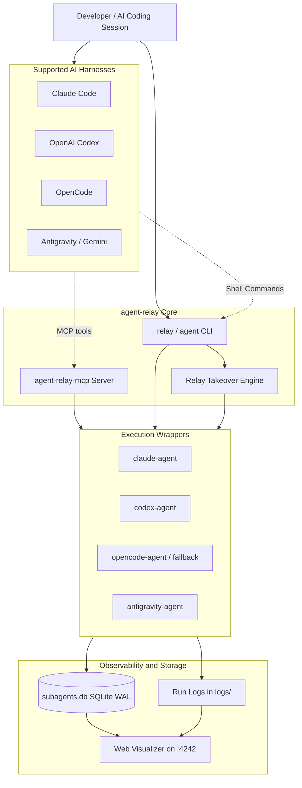

# Agent Relay architecture

Provider agents run on the host. The CLI and MCP server share run tracking,
logs, and a local dashboard that can run with Node.js or Docker.

```mermaid
flowchart TD
    User["Developer / AI Coding Session"]

    subgraph Harnesses [Supported AI Harnesses]
        Claude["Claude Code"]
        Codex["OpenAI Codex"]
        OpenCode["OpenCode"]
        Agy["Antigravity / Gemini"]
    end

    subgraph RelayCore [agent-relay Core]
        CLI["relay / agent CLI"]
        MCP["agent-relay-mcp Server"]
        Takeover["Relay Takeover Engine"]
    end

    subgraph Wrappers [Execution Wrappers]
        WClaude["claude-agent"]
        WCodex["codex-agent"]
        WOpen["opencode-agent / fallback"]
        WAgy["antigravity-agent"]
    end

    subgraph Storage [Observability and Storage]
        DB[("subagents.db SQLite WAL")]
        Logs["Run Logs in logs/"]
        Dashboard["Web Visualizer on :4242"]
    end

    User --> Harnesses
    User --> CLI
    Harnesses -.->|MCP tools| MCP
    Harnesses -.->|Shell Commands| CLI
    MCP --> Wrappers
    CLI --> Wrappers
    CLI --> Takeover
    Takeover --> Wrappers
    Wrappers --> DB
    Wrappers --> Logs
    DB --> Dashboard
    Logs --> Dashboard
```
